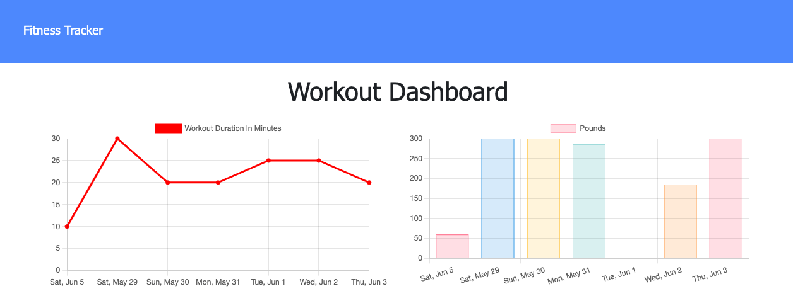

# 17-workout-tracker

## Table of Contents
* [Introduction](#introduction)
* [Functionality](#functionality)
* [Tasks Completed](#tasks-completed)
* [Technologies Used](#technologies-used)
* [Demo](#demo)
* [Future Ideas](#future-ideas)
* [Sources](#sources)
* [License](#license)

 ## Introduction
User can view and create daily workouts as well as see their stats from the past 7 days.
* Heroku: https://shielded-tor-16993.herokuapp.com/
* GitHub: https://github.com/JXIong15/17-workout-tracker

## Functionality
* When the user loads the page, they are given the option to create a new workout or continue with their last workout.
* User can add new exercises to current/ most recent workout.
* User can create a new workout plan.
* User can view their 7 day progress on the Stats page.
    * Can view duration of past 7 workouts
    * Can view total weight of past 7 workouts

## Tasks Completed
* Dowloaded necessary NPM packages with `npm install` on the Command Line
* Created server.js and necessary folders for development
* In server.js, connected the server and routes
* Created a Workout schema for the workout object
* Created api and html routes
* Referenced the `public/api.js` routes to use in the `routes/api.js` file
    * In `routes/api.js`, created routes to the database to `GET` and `UPDATE` workouts
    * Used an `aggregate` function to `$addFields` and `$sum` the duration of all exercises to get the `totalDuration` of the workout
    * In the html.js file, connected routes to show the desired html pages
* Seeded data on MongoDB Atlas.
* Created a MongoDB database and collection for the data. Conencted it to deploy on Heroku.

## Technologies Used
* Routes
* Heroku
* MongoDB
* Express

## Demo
* App Demo:

   
## Future Ideas
* Get MongoDB to run seed.js file to auto-seed database. I had to type this out manually as a JSON array in Mongo Atlas.

## Sources
* NPM Packages: https://www.npmjs.com/
* MongoDB Atlas: https://www.mongodb.com/cloud/atlas
* Robo 3T: https://robomongo.org/
* Heroku: https://devcenter.heroku.com/articles/heroku-cli

## License
Licensed under the [MIT License](LICENSE).

© 2021 Trilogy, Northwestern Coding Bootcamp

